# 🏠 Home Grock

> A personal finance & inventory management tool to help you save money, get out of debt, and take control of your cash flow.
>
> From "too many expired medicines" to "using them before they expire"
> From "don't know how much I owe" to "know exactly when I can be debt-free"

## 💡 Why We Built This?

### Problem 1: Items are constantly wasted 😭

My struggles before:
- **Too many hoarded medicines**: Cold medicine, band-aids, vitamins... discovered a pile of expired ones during spring cleaning, threw away hundreds of dollars
- **Kitchen condiments expire**: Bought oyster sauce, bean paste, forgot to use them, got moldy after half a year
- **Duplicate purchases**: Already have it at home, bought another one out of habit, wasting money
- **Impulsive shopping**: Bought too many on sale, ended up not using them

**Wasting hundreds of dollars every month just on these items.**

### Problem 2: Debt stress is overwhelming 😰

I also have debts:
- 3 credit card installments
- Alipay, JD.com's Baitiao
- Don't know how much to pay every month
- Don't know when I can pay everything off

**Every month, after paying debt and throwing away expired items, there's almost nothing left.**

### Solution 💡

I built this tool to help myself:

**Item Management** - Prevent Waste
- ✅ Scan and record everything at home (medicines, condiments, groceries)
- ✅ Auto reminder for expiring items (7, 3, 1 days before)
- ✅ Check inventory before buying (avoid duplicate purchases)
- ✅ AI receipt recognition (upload receipt → auto extract items)

**Finance Management** - Get Debt-Free
- ✅ Understand all debts (total amount? monthly payment?)
- ✅ Auto-generate repayment plan (when can I be debt-free?)
- ✅ Early repayment calculator (how much interest can I save?)
- ✅ Expense analysis (where did the money go? where to save?)

**Result: Save Money + Pay Debt = Get Debt-Free Faster**

Now a few classmates and colleagues are using it too, and they say it really reduces waste.

---

## 😫 Are You Facing These Problems?

### Medicine Management Pain

<table>
<tr>
<td width="50%">

#### 😭 Before

- Bought cold medicine in multiple boxes, stored in different places
- Can't find it when needed, buy again
- Found a pile of expired medicine during cleaning
- **Threw away hundreds of dollars**

</td>
<td width="50%">

#### 😊 Now

- Scan and record as soon as I buy, know where it is
- Get reminder 7 days before expiration
- Check inventory before buying
- **Never throw away expired medicine again**

</td>
</tr>
</table>

### Kitchen Supplies Pain

<table>
<tr>
<td width="50%">

#### 😭 Before

- Too many condiment bottles, don't know what I have
- Oyster sauce, bean paste opened and forgotten
- Bought 3 bottles of soy sauce, 2 expired
- **Lots of items expire in batches, heartbreaking**

</td>
<td width="50%">

#### 😊 Now

- Scan all condiments when buying
- Get reminder before expiration (time to use this!)
- Check inventory before buying (still have 2 bottles)
- **Didn't throw away expired condiments in half a year**

</td>
</tr>
</table>

### Debt Management Pain

<table>
<tr>
<td width="50%">

#### 😭 Before

- Credit cards, Alipay, JD Baitiao... confused
- Don't know how much to pay every month
- Don't know when can pay everything off
- **Sometimes paid wrong, missed payment, late fees**

</td>
<td width="50%">

#### 😊 Now

- All debts crystal clear
- Auto-generated repayment plan
- Monthly reminder, never miss payment
- **Know I can be debt-free in 18 months!**

</td>
</tr>
</table>

---

## ✨ Core Features

### 📦 Item Management - Scan & Record, Prevent Waste

<div align="center">
  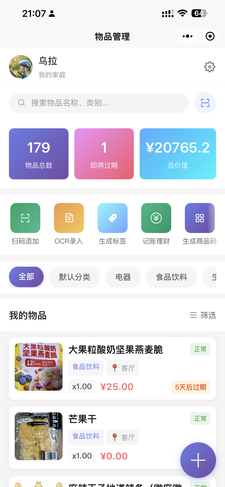
  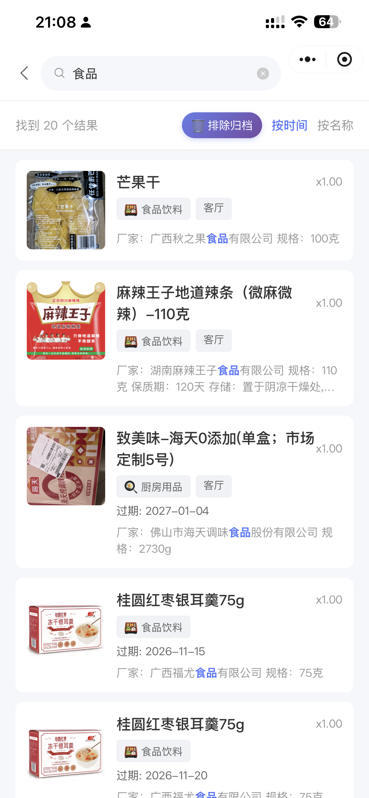
  
</div>

<div align="center">
  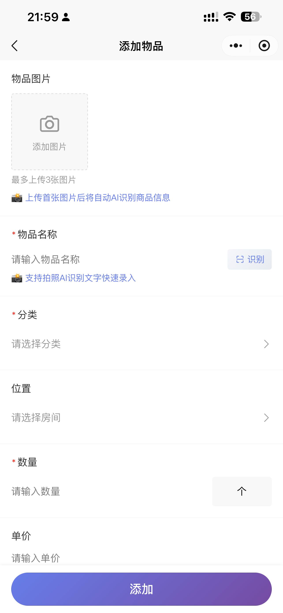
</div>

```
Buy → Scan barcode → AI recognize → Auto record → Expiry reminder → Use before expire
```

**Supports Recognition**:
- Product barcodes (supermarket shopping)
- Medicine tracking codes (medicine-specific)
- AI photo recognition (no barcode? just take a photo)
- Receipt batch import (supermarket receipt → auto extract)

### 🔍 Barcode Recognition - One Scan Records Everything

<div align="center">
  
  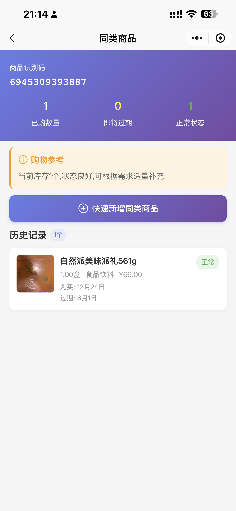
  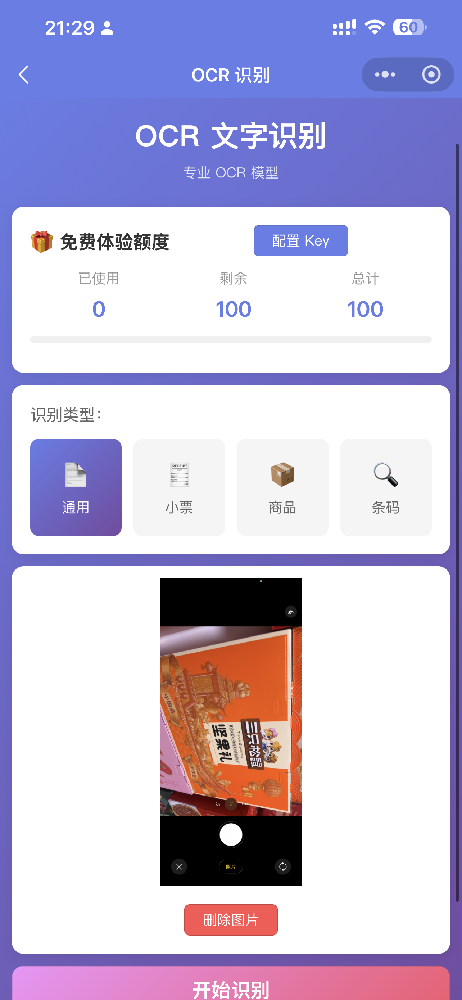
</div>

```
Open scanner → Point at barcode → Auto recognize → Fill info → Save
```

### 🤖 AI Expiry Reminder - Never Waste Again

<div align="center">
  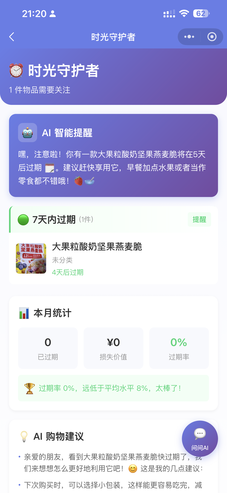
  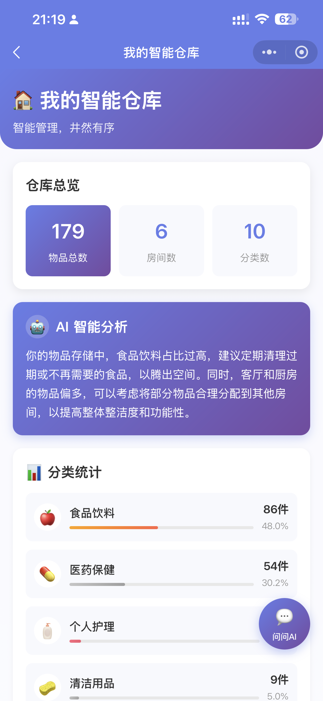
</div>

- **AI smart reminder** - tells you which items expire soon
- **AI shopping advice** - recommends based on inventory
- **Smart warehouse analysis** - item distribution, category stats

### 💰 Finance Recording - AI Receipt Recognition, Auto Categorization

<div align="center">
  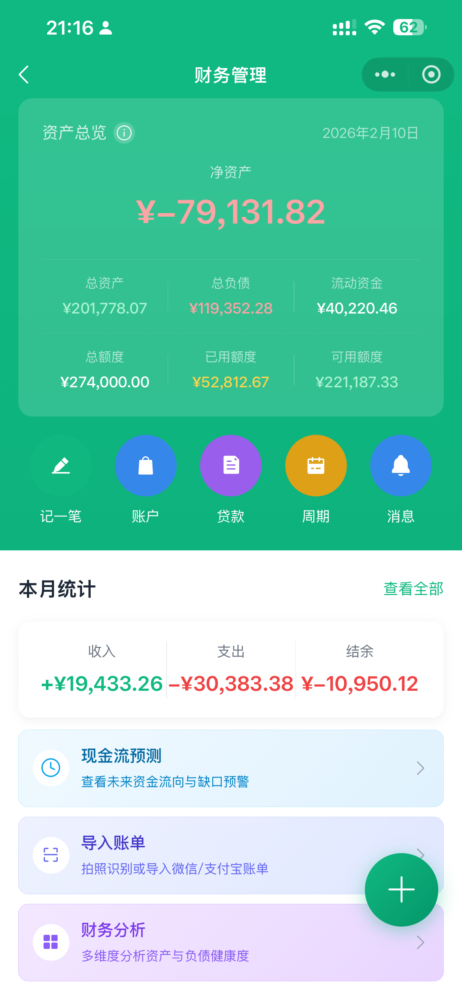
  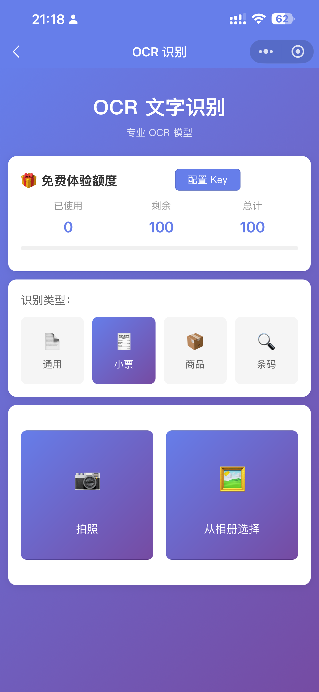
  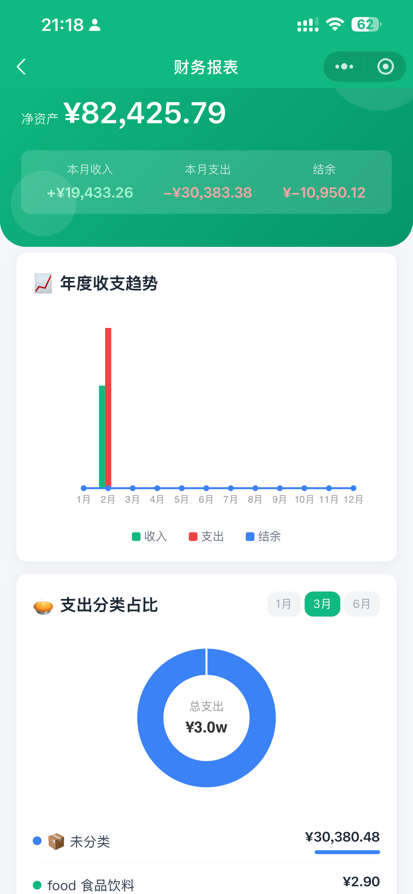
</div>

```
Take receipt photo → AI recognize → Auto import → Smart categorize → Analyze spending → Find waste
```

**Supports Import**:
- AI receipt recognition (photo auto extract)
- WeChat bill import (CSV file)
- Alipay bill import (CSV file)
- Manual recording (quick input)

### 📊 Debt Management - Clear Debts, Get Debt-Free Faster

<div align="center">
  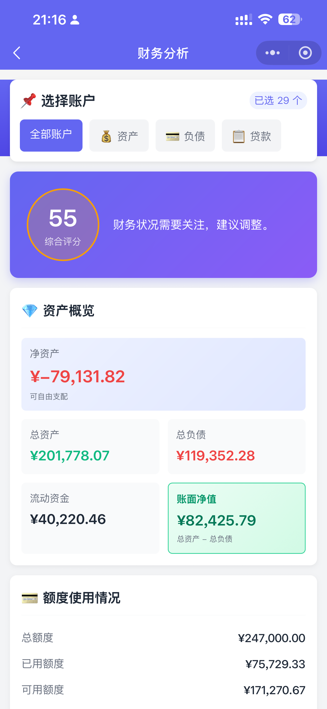
  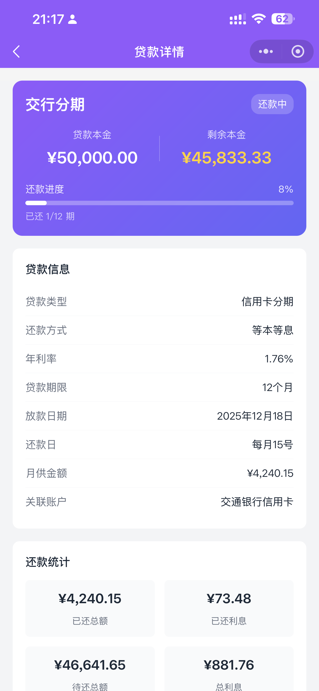
  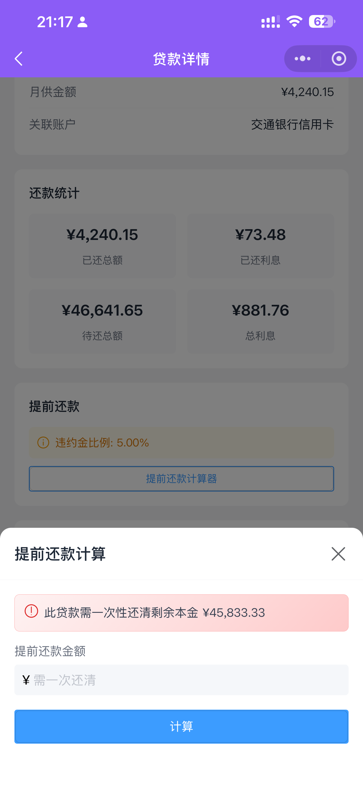
</div>

<div align="center">
  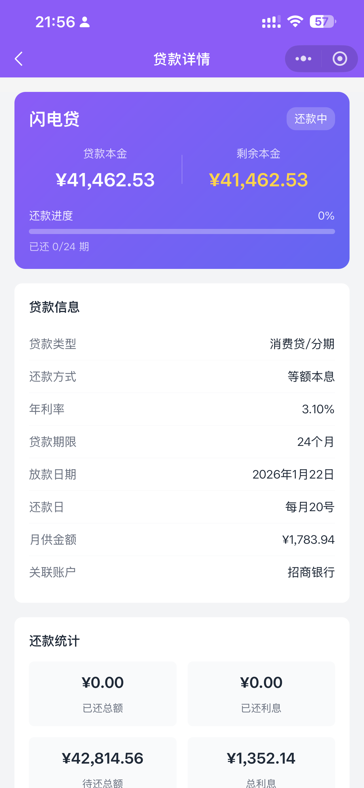
</div>

```
Record loan → Auto generate repayment plan → Monthly reminder → Early repayment calc → Optimize strategy
```

**Supports Debt Types**:
- Credit card installments
- Alipay, JD Baitiao, Alipay Borrow
- Mortgage, auto loan
- Consumer loan, cash loan

**Supports Repayment Methods**:
- Equal principal and interest (mortgages)
- Equal principal, equal interest (credit cards)
- Equal principal (bank loans)
- Interest first, principal last (short-term loans)
- Lump sum at maturity
- Flexible payment

### 📈 Cash Flow Forecast - Avoid Cash Crunch

<div align="center">
  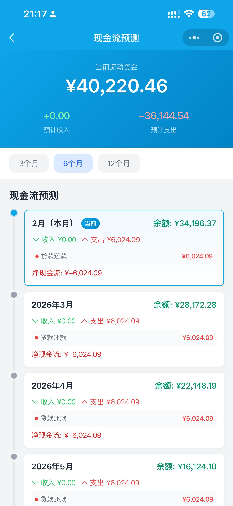
  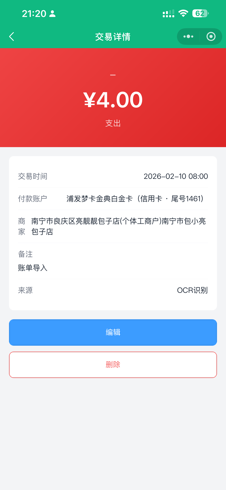
</div>

- 12-month cash flow projection
- Early warning for cash gaps
- See income, expense, repayment at a glance

### 🗂️ More Features

<div align="center">
  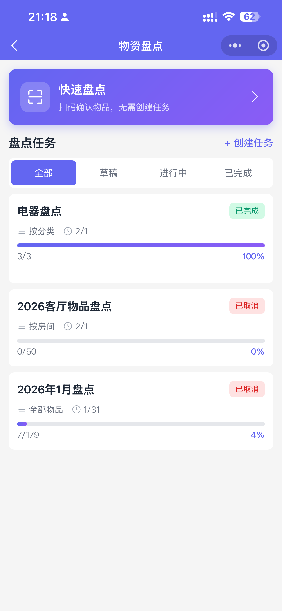
  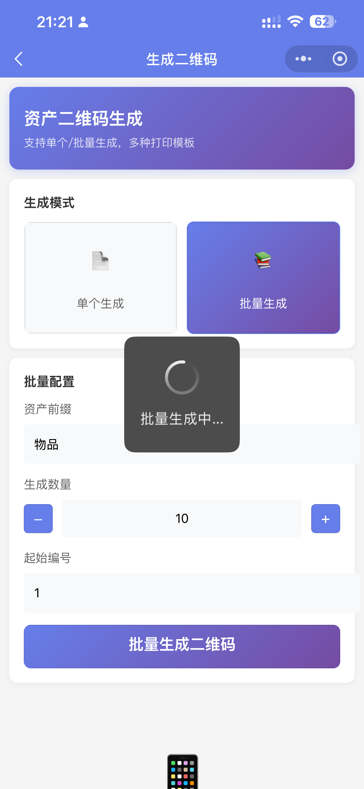
  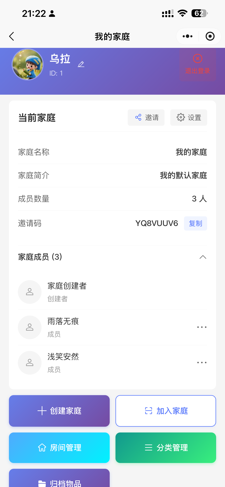
</div>

- **Asset Inventory**: Year-end spring cleaning, scan to confirm, auto compare differences
- **Label Generation**: Batch generate QR code labels, stick on items for easy tracking
  - Each item has unique QR code
  - Scan to see item details
  - Support batch generation and printing
- **Family Collaboration**: Invite family to manage together, share data

### 📱 Product QR Code

<div align="center">
  
  <p><strong>👆 Item label example</strong></p>
</div>

Each item has a unique QR code. Scan it to see:
- Item name, category, location
- Purchase date, expiry date
- Quantity, unit price, total value
- Update history, edit item

---

## 🎉 Real User Stories

### Story 1: Save ¥6,000 in a Year

**User**: Xiaoli, 27 years old, Shanghai, Programmer

**Before**:
- Medicines, seasonings expire often, waste ¥200+ monthly
- Duplicate purchases, waste ¥100+ monthly
- Impulsive shopping, waste ¥300+ monthly
- **Total waste: ¥600+ per month**

**After**:
- Scan and record all items, expiry reminder
- Check inventory before buying
- Analyze spending before purchase
- **Reduce waste by ¥500 monthly**

**One year result**: Saved ¥6,000, paid off half of Alipay debt

### Story 2: Pay Off All Debt in 18 Months

**User**: Xiaozhang, 30 years old, Guangzhou, Designer

**Debt Situation**:
- Bank of China credit card: ¥20,000, 12 installments
- Alipay: ¥8,000
- JD Baitiao: ¥5,000
- **Total debt: ¥33,000**

**Before**:
- Don't know total debt
- Don't know monthly payment
- Often forget to pay, late fees
- Payment stress

**After**:
- Clear view of all debt and repayment plan
- Monthly reminder, never miss
- Speed up repayment through saving
- **Paid off everything in 18 months**

**Bonus**: Early repayment saved ¥2,000 interest

---

## 🚀 How to Use?

### WeChat Mini Program (Recommended)

<div align="center">
  
  <p><strong>👆 Scan with WeChat</strong></p>
</div>

```
Scan → Authorize login → Start now
```

**Advantages**:
- Use anytime, anywhere
- Scan with phone very convenient
- No need to install app
- Auto cloud backup

### Web Admin Dashboard

🔗 https://web.home-grock.com

**Advantages**: Large screen, more powerful data analysis

**Login Methods**:
- 🔐 Username & password
- 📱 WeChat mini program scan (Recommended, no password needed)

<div align="center">
  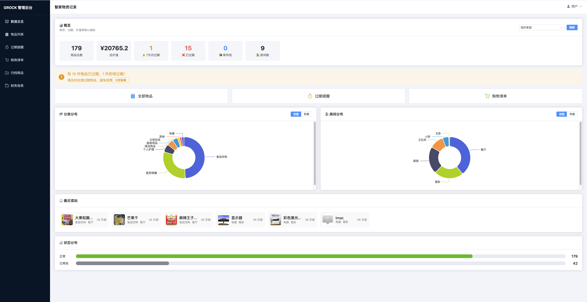
  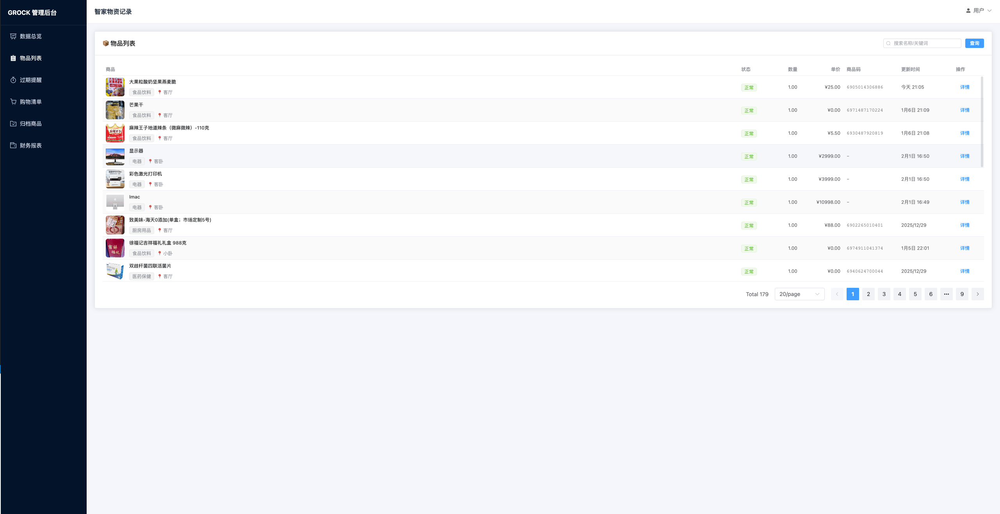
  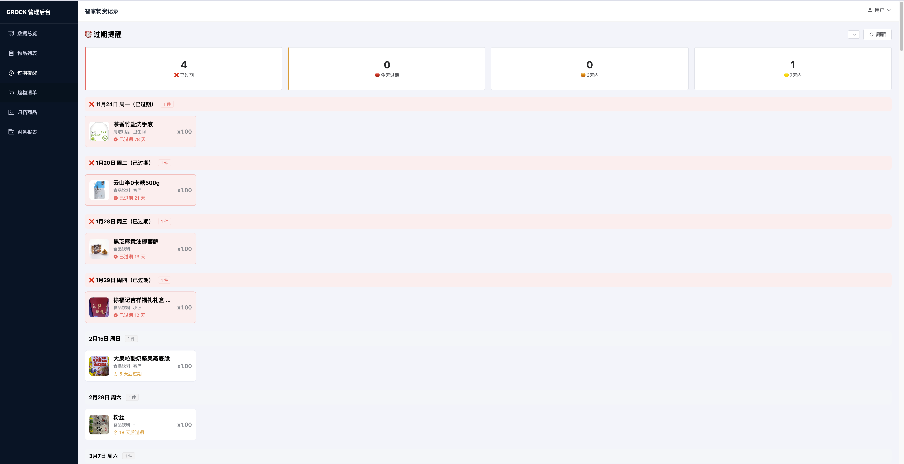
</div>

<div align="center">
  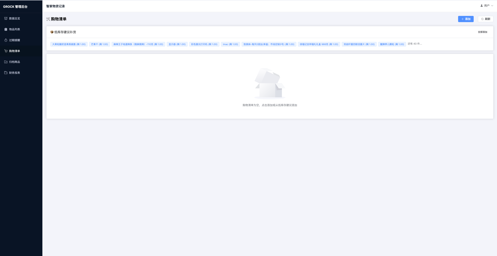
  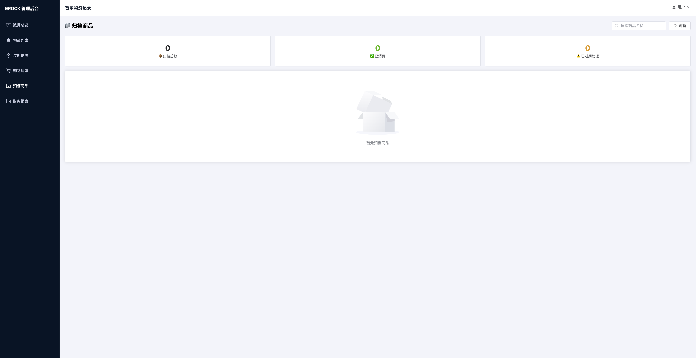
  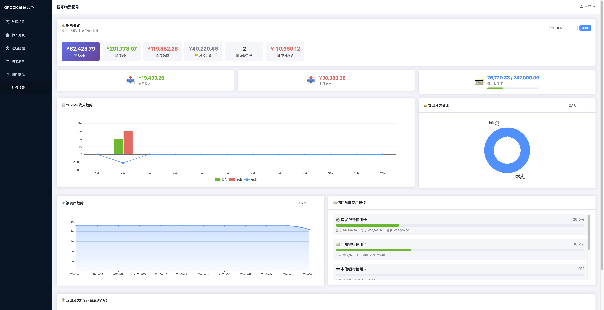
</div>

<div align="center">
  
  <p>👆 Scan QR code with mini program to login to web dashboard</p>
</div>

---

## 📚 User Guides

### Getting Started

- [3-minute Quick Start](docs/guides/quick-start.md)
- [Complete Item Management Guide](docs/guides/item-management.md) - How to record items
- [Complete Debt Management Guide](docs/guides/debt-management.md) - How to manage debt

### Common Questions

Have questions? Welcome to [open an issue](../../issues) or [join discussion](../../discussions)!

---

## 💰 Completely Free

This project is for my own use, and I'm opening it to everyone.

**Completely free, no ads, data private.**

As long as the server can handle it, it stays free forever.

---

## 🔐 Data Privacy

### Your Data is Completely Private

- ✅ All data encrypted storage
- ✅ Never share with any third party
- ✅ Never use for ads or other commercial purpose
- ✅ Can export and delete data anytime

### We Don't Collect

- ❌ Real name
- ❌ Bank card number
- ❌ ID number
- ❌ Location information

### Future Plans

Will provide Docker image so you can:
- Run on your own server
- Data stays completely in your hands
- Don't depend on my server

---

## 🤝 Feedback & Suggestions

If you're using this tool, welcome to:
- Report issues
- Suggest features
- Share your experience

---

## 🗺️ Product Roadmap

### ✅ Already Implemented (v3.0)

- [x] Barcode recognition (barcode, QR code, medicine tracking)
- [x] AI receipt recognition (photo auto extract)
- [x] Expiry reminder (7/3/1 days before)
- [x] Debt management (6 repayment methods)
- [x] Smart recording (AI auto categorize)
- [x] Cash flow forecast (12 months)
- [x] Asset inventory (year-end audit)

### 🚀 In Progress (2026 Q1)

- [ ] Recipe recommendations (based on expiring ingredients)
- [ ] Smart shopping list (auto remind what's needed)
- [ ] Family member permissions (collaborative management)
- [ ] Data export (Excel/PDF reports)

### 💡 Planned (Vote to Decide)

1. **Recipe Recommendations** - AI suggests dishes based on expiring ingredients
2. **Purchase Reminders** - Auto remind when frequently used items run out
3. **Resell Unused Items** - Sell unused items to pay debt
4. **E-commerce Integration** - One-click reorder

---

## 📊 System Architecture

- **Frontend**: UniApp + Vue 3 (cross-platform)
- **Backend**: Node.js + Express + MySQL
- **AI Service**: Silicon-based Flow (DeepSeek + Qwen Vision Model)
- **Storage**: MinIO object storage + Redis cache

---

## 📦 Open Source Plan

Core code not open source yet.

Will open in future:
- ✅ **Utilities** (loan calculation, barcode generation)
- ✅ **API Documentation** (complete API docs)
- ✅ **Docker Image** (one-click deploy)
- 📋 **Complete Source Code** (still evaluating...)

---

## ⭐ If This Helps You

Give it a star! That's my biggest encouragement!

---

## 📧 Contact

- **Updates**: [CHANGELOG.md](CHANGELOG.md)

---

**Author**: A programmer who wants to get debt-free and stop wasting 😊

**License**: MIT

**Last Updated**: 2026-02-10

---

[中文版](README.md) | [English](README.en.md)
